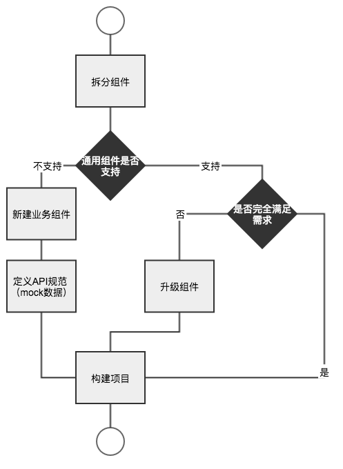
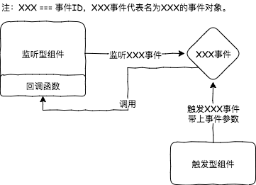

# Paas平台组件使用手册
----

## 组件开发规范
组件开发规范请参考[明源云移动PaaS - 业务组件开发指引
](http://open.mypaas.com.cn/paas/#!biz-component.md)。

## 组件开发流程

## 组件通讯流程

### 触发型组件
* [选项卡组件](basic-components/tabs.md)
* [日期时间组件](basic-components/datetime.md)

### 监听型组件
* [数据集组件](components-panel/dataset.md)
* [表单容器](components-panel/form.md)
