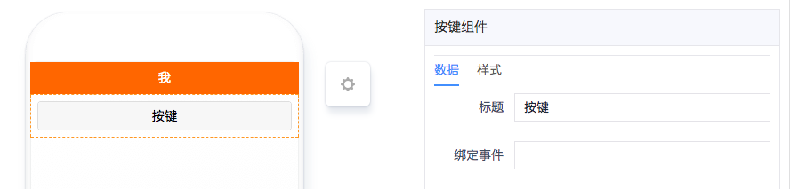
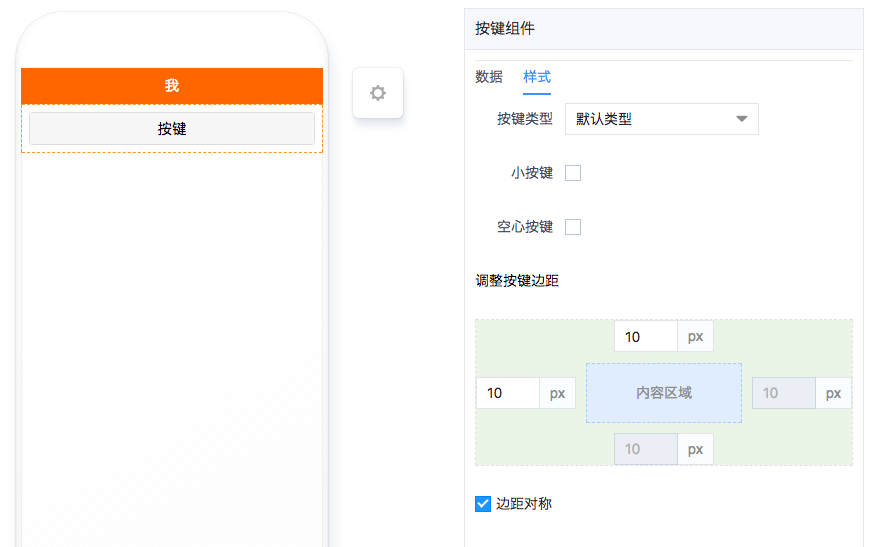

# 按键组件

---

## 简介

### 主要功能

主要用于触发其他组件申明的事件。

### 应用场景

任何需要用户手动触发事件的场景都适用。

### 缩略图

## 配置说明

| 配置项 | 描述 | 是否必填 | 备注 |
| :--- | :--- | :--- | :--- |
| 标题 | 按键上的文字内容 | 是 | 无 |
| 绑定事件 | 需要触发的组件事件ID。 | 是 | 无 |
| 按键类型 | 主要分默认类型、主题类型和警示类型。 | 是 | 无 |
| 小按键 | 按钮尺寸更小。 | 否 | 无 |
| 空心按键 | 按钮的内部不填充颜色。 | 否 | 无 |
| 调整按键边距 | 设置按键与四周的间隔距离。 | 否 | 勾选「边距对称」可以只调节上、左两边的间距。 |