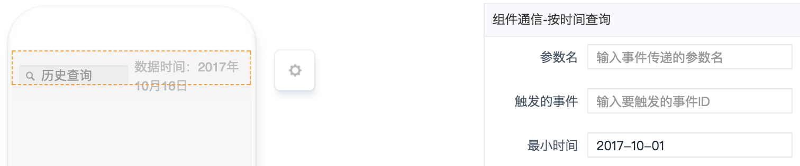
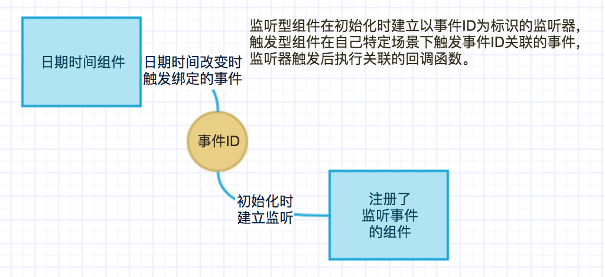

# 日期时间组件

----

## 简介

### 功能

日期时间改变时**触发**绑定的事件，可以用来做时间**筛选**条件。

### 应用场景

可以结合具有**监听**功能的组件，来作为过滤条件**筛选**数据。

### 缩略图

### 组件依赖

## 配置说明

|配置项|必填|数据类型|格式|备注|
|:--|:--|:--|:--|:--|
|参数名|是|String|param1||
|触发的事件|是|String|onXXX-XXXX-XXXX||
|最小时间|是|String|2017-10-16||

## 注意事项

* 事件ID需要与监听型组件的事件ID对应。
* 参数名是事件触发后所传参数的key值，结合数据集容器做过滤查询时需要按照后端约定好的API文档来定义。
* 最小时间用来限制用户选到的最早时间，格式必须是`yyyy-mm-dd`。
