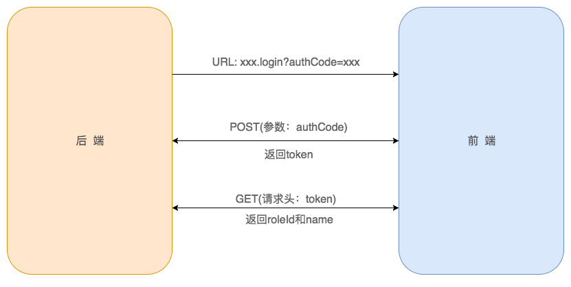
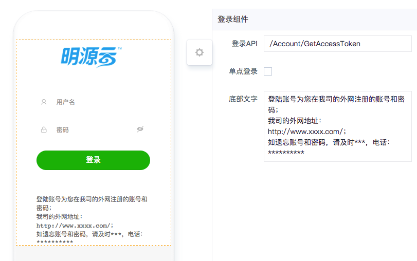
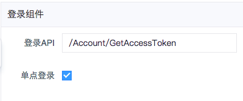
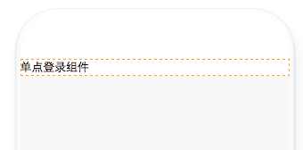

# 登录组件

## 简介

### 主要功能
主要用于登录页，本组件提供了单点登录和账号登录两种登录方式。
#### 单点登录
单点登录通过密钥的方式获取用户Token，并将Token保存在本地存储，前后端交互的流程见如下图所示：

### 应用场景
根据不同的登录需求选择相应的登录模式。

### 缩略图

## 配置说明

| 配置项 | 描述 | 是否必填 | 示意图 | 备注 |
| :--- | :--- | :--- | :--- | :--- |
| 登录API | 当前组件登录所请求的API地址 | 是 |  |  |
| 单点登录 | 切换登录模式，单点登录或帐号登录 | 是 |  |  |
| 底部文字 | 帐号登录时的底部登录说明 | 否 | （见缩略图） |  |

