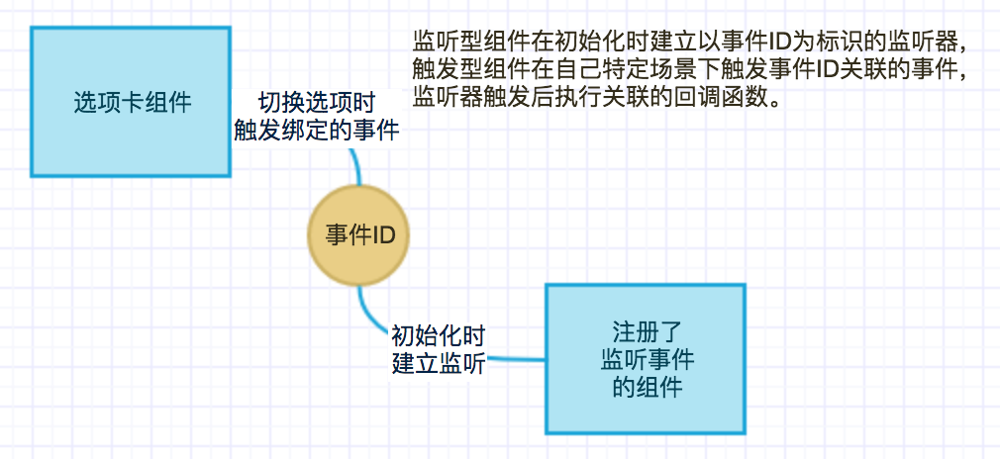

# 选项卡组件

----

## 简介

### 功能

在选项改变时**触发**绑定的事件，可以用来做条件**筛选**或者页签**切换**。

### 应用场景

可以结合具有**监听**功能的组件，来作为过滤条件**筛选**数据，或者作为页签**切换**。

### 缩略图

### 组件依赖

## 配置说明

|配置项|必填|数据类型|格式|版本|
|:--|:--|:--|:--|:--|
|参数名|是|String|param1|v0.0.1|
|触发的事件|是|String|onXXX-XXXX-XXXX|v0.0.1|
|TAB名|是|String|a|v0.0.1|
|TAB值|是|String|a|v0.0.1|
|默认值|是|Radio||v0.0.1|

## 注意事项

* 事件ID需要与监听型组件的事件ID对应。
* 目前最多只能设置5个选项卡。
* 参数名是事件触发后所传参数的key值，结合数据集容器做过滤查询时需要按照后端约定好的API文档来定义。
