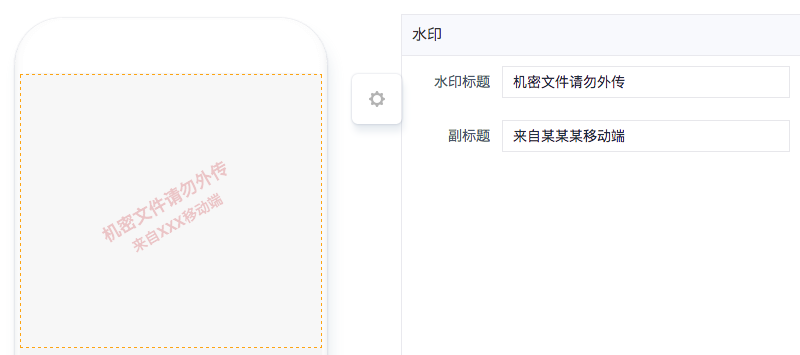
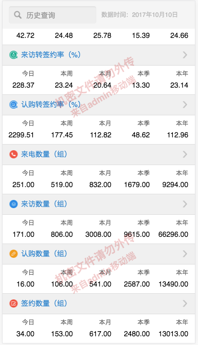

# 水印组件

---

## 简介

### 主要功能

可在页面上覆盖一层透明水印，水印内容可自定义。

### 应用场景

主要用于某些数据的保护，避免恶意截图传播。

### 缩略图
- 设计模式

> 

- 实际效果

> 

## 配置说明

| 配置项 | 描述 | 是否必填 | 备注 |
| :--- | :--- | :--- | :--- |
| 水印标题 | 水印的主标题文字内容 | 是 | 无 |
| 副标题 | 水印的副标题文字内容，该内容可根据登录信息变化。 | 否 | 无 |

## 注意事项

由于兼容性考虑，设计时水印组件需要放在页面顶端。

