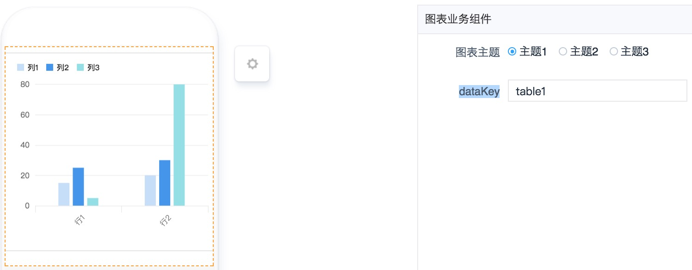
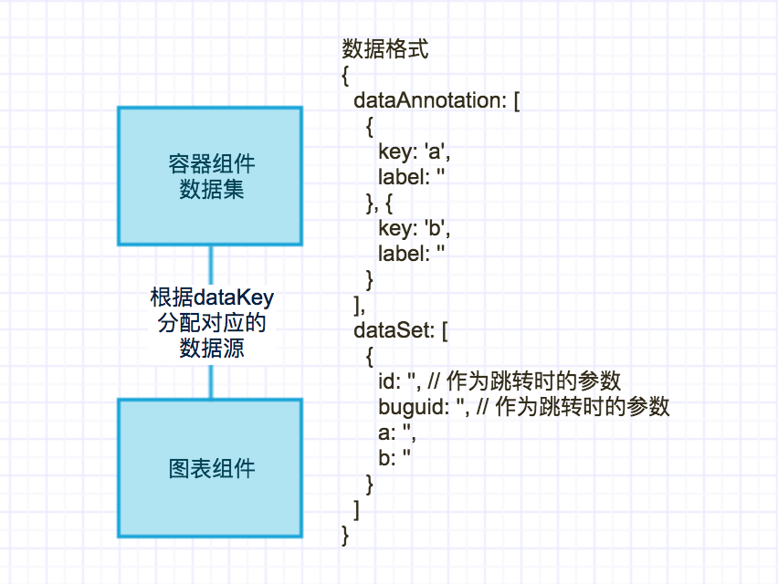

# 图表组件

----

## 简介

### 功能

获取**数据集组件**分配的数据源，以**图表**的形式展示

### 应用场景

单独使用没有意义，需要结合**容器组件**一同使用。

### 缩略图



### 组件依赖



## 配置说明

|配置项|必填|数据类型|格式|备注|
|:--|:--|:--|:--|:--|
|图表主题|是|Radio||无|
|dataKey|是|String|table1|无|

## 注意事项

* `dataKey`需要事先与后端商量好，配置页面时，在对应的展示组件填上`dataKey`。
* 数据格式
	 
```
{
  dataAnnotation: [
    {
      key: 'a',
      label: ''
    }, {
      key: 'b',
      label: ''
    }
  ],
  dataSet: [
    {
      id: '', // 作为跳转时的参数
      buguid: '', // 作为跳转时的参数
      a: '',
      b: ''
    }
  ]
}
```
