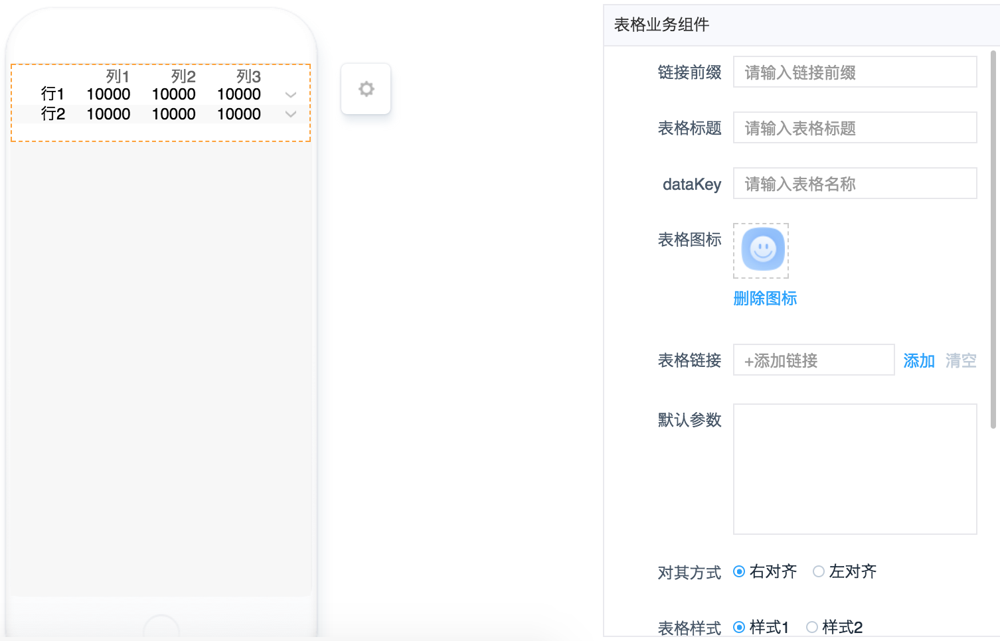
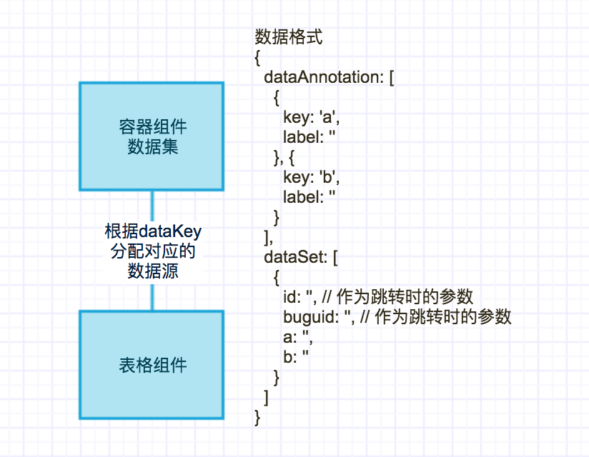

# 表格组件

----

## 简介

### 功能

获取**数据集组件**分配的数据源，以**表格**的形式展示

### 应用场景

单独使用没有意义，需要结合容器组件一同使用。

### 缩略图



### 组件依赖



## 配置说明

|配置项|必填|数据类型|格式|备注|
|:--|:--|:--|:--|:--|
|链接前缀|否|String|`abcd://`||
|表格标题|否|String|`a`||
|dataKey|是|String|`table1`||
|表格图标|否|Img|||
|表格链接|否|Link|||
|默认参数|否|Json|`{"getdate":"new Date()"}`||
|对其方式|是|Radio|||
|表格样式|是|Radio|||
|表数据链接|否|Link|||
|默认参数|否|Json|`{"getdate":"new Date()"}`||
|是否展示详情|是|Radio|||

## 注意事项

* `dataKey`需要事先与后端商量好，配置页面时，在对应的展示组件填上`dataKey`。
* 数据格式
	 
```
{
  dataAnnotation: [
    {
      key: 'a',
      label: ''
    }, {
      key: 'b',
      label: ''
    }
  ],
  dataSet: [
    {
      id: '', // 作为跳转时的参数
      buguid: '', // 作为跳转时的参数
      a: '',
      b: ''
    }
  ]
}
```
