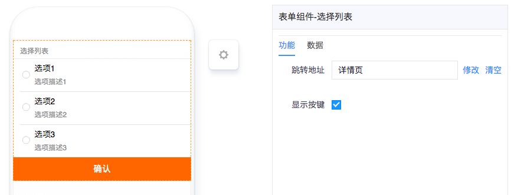
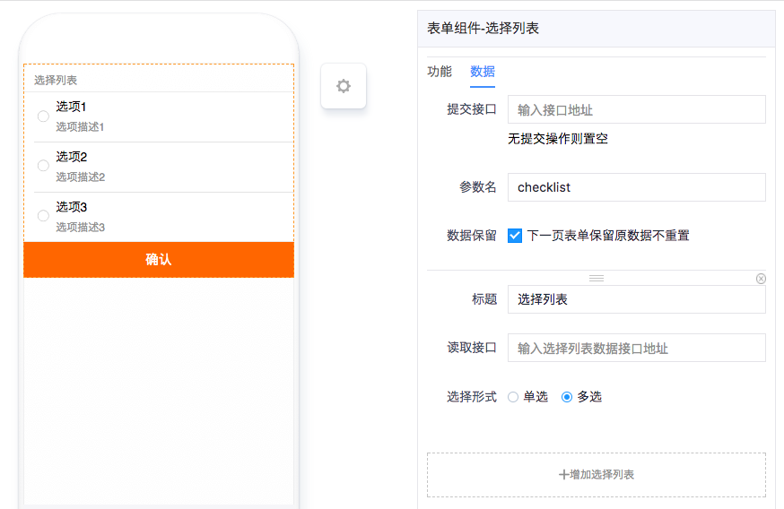
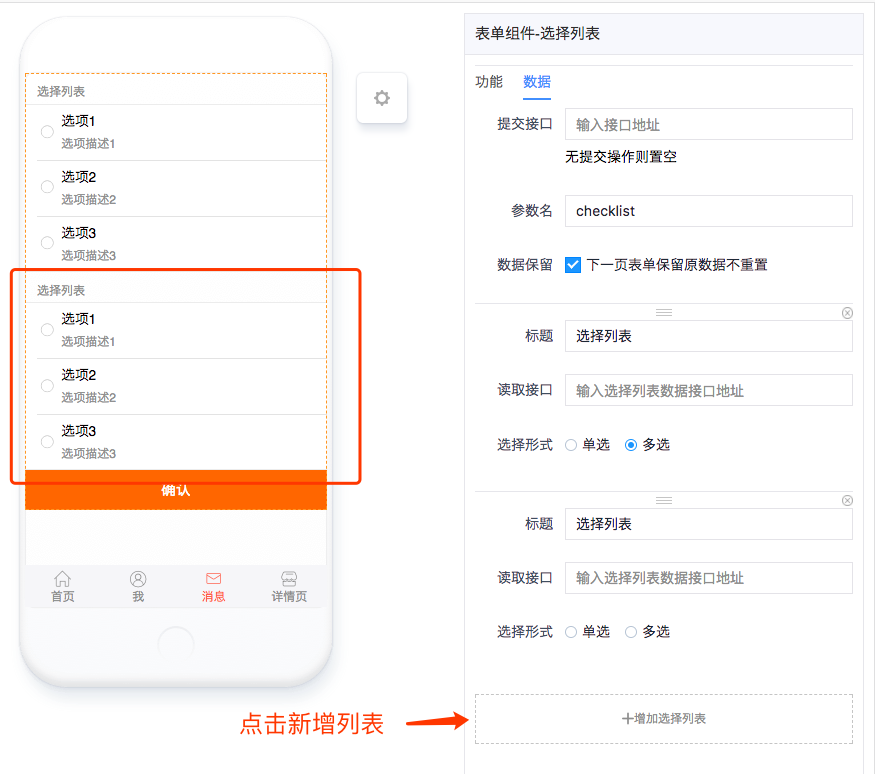

# 选择列表

---

## 简介

### 主要功能

需要选择的数据量较大，或者数据比较复杂时，使用选择列表来完成选择数据的功能，可以同时加载多个选择列表。

### 应用场景

可配合跳转选择组件使用，也可以单独作为一个选择列表页面，例如购物应用的购物车页面。

### 缩略图

## 配置说明

| 配置项 | 描述 | 是否必填 | 备注 |
| :--- | :--- | :--- | :--- |
| 跳转地址 | 选择完成之后的跳转页面 | 是 | 无 |
| 显示按键 | 是否显示底部的确认键，确认则提交数据或跳转页面。 | 否 | 只有在选择列表唯一且是单选时可以不显示按键，此时选择之后会立即跳转到下一页。 |
| 提交接口 | 选择列表的结果提交的接口API。 | 否 | 如果不需要提交数据则无需填写，比如与跳转选择组件联动时。 |
| 参数名 | 选择列表数据对应提交接口的字段名。 | 是 | 如果是配合跳转选择组件，则需与跳转选择组件的参数名保持一致。 |
| 数据保留 | 勾选则跳转后的表单不会自动从API拉取默认值。 | 否 | 与跳转选择组件配合时需勾选该项。 |
| 标题 | 选择列表的主标题。 | 否 | 无 |
| 读取借口 | 列表选项数据的读取API地址。 | 是 | 无 |
| 选择形式 | 当前选择列表是单选还是多选。 | 是 | 默认为单选 |

## 注意事项

### 多个选择列表

有些特殊情况，在一个选择列表页面中可能会同时存在多个选择列表，此时只需要在「数据」栏的底部点击「增加选择列表」，配置方式参考配置说明。

如需删除这个列表，直接点击右上角的「x」就行。