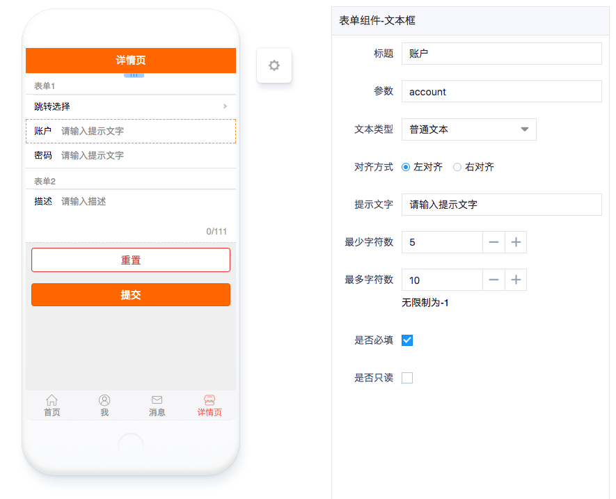

# 文本框

---

## 简介

### 主要功能

文本框组件主要用于简单文本的录入。

### 应用场景

常见的文本录入，例如账号、密码、各种信息等。

### 缩略图

## 配置说明

| 配置项 | 描述 | 是否必填 | 备注 |
| :--- | :--- | :--- | :--- |
| 标题 | 该表单组件的标题 | 是 | 无 |
| 参数 | 该表单组件对应的API关键字。 | 是 | 无 |
| 文本类型 | 目前可选的文本类型有普通文本、数字文本和密码文本。 | 是 | 默认为普通文本 |
| 对其方式 | 可设置填写内容左对齐或右对齐。 | 是 | 无 |
| 提示文字 | 无填写内容时的提示文字，尽量与内容要求相关。 | 否 | 无 |
| 最少字数 | 填写内容最少应填字数，如果少于该字数则会报错并且无法提交数据。 | 否 | 无 |
| 最多字数 | 填写内容最多可填字数，如果超过该字数则无法继续输入。 | 否 | 没有限制则设为-1 |
| 是否必填 | 是否必须填入内容。 | 否 | 无 |
| 是否只读 | 设为只读则不能填写内容。 | 否 | 无 |