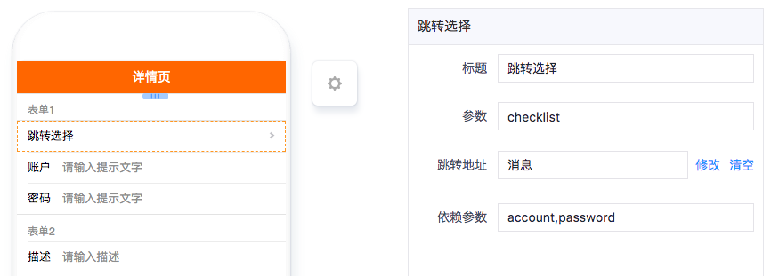

# 跳转选择

---

## 简介

### 主要功能

选择器组件，需配合选择列表使用，跳转页面时可携带当前表单容器中的数据进行列表筛选，该组件主要用于当前表单页和选择列表页的数据通信。

### 应用场景

当选择项的数据很多时，使用弹窗选择就不太合适，这时就需要跳转到另一个页面来选择数据，选择完成之后将数据带回到原表单。

### 缩略图

- 设计模式

- 实际效果

## 配置说明

| 配置项 | 描述 | 是否必填 | 备注 |
| :--- | :--- | :--- | :--- |
| 标题 | 该表单组件的标题 | 是 | 无 |
| 参数 | 该表单组件对应的API关键字。 | 是 | 无 |
| 跳转地址 | 指向的选择列表页面。 | 是 | 无 |
| 依赖参数 | 选择列表获取数据API依赖的参数，从当前表单容器获取，详见注意事项。 | 否 | 无 |

## 注意事项

### 依赖参数

比如当前表单页面API中有姓名、手机号码这两个表单组件，对应的API参数是name, mobile，选择列表需要依据这两个参数进行筛选，则在依赖参数中填写「name,mobile」，用英文逗号分隔，则跳转到选择列表页面时，会将当前表单页面的name和mobile对应的数据带过去进行筛选。