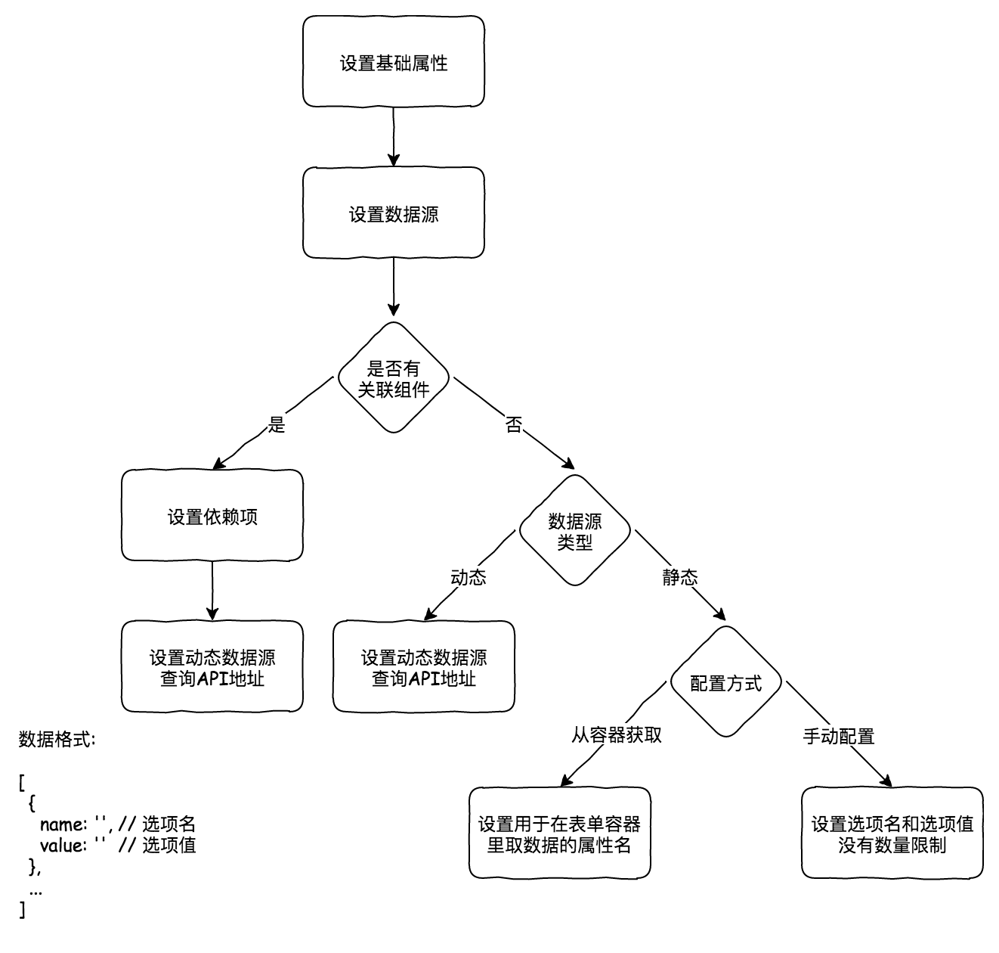
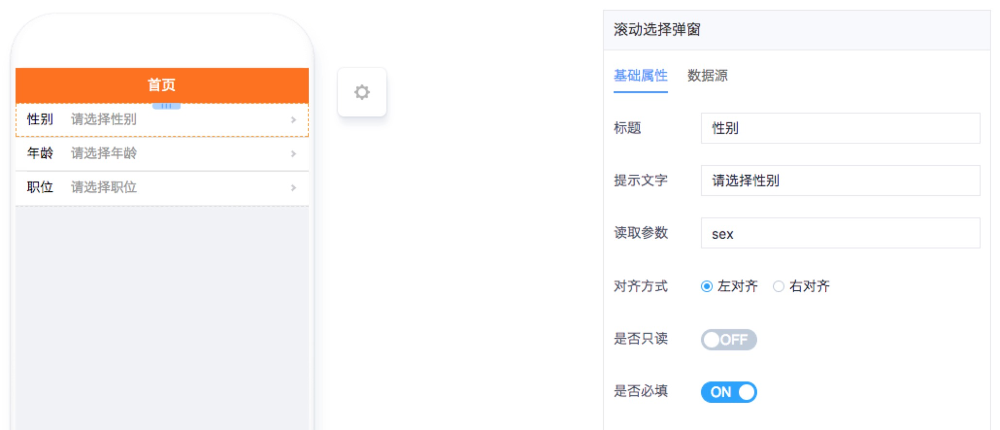
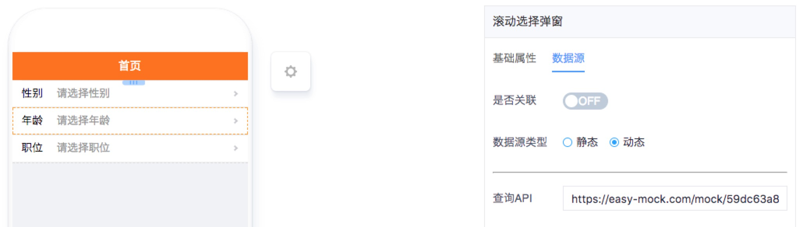
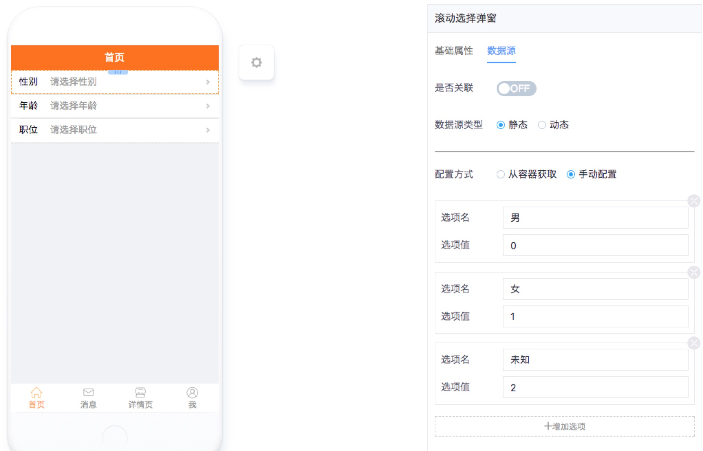
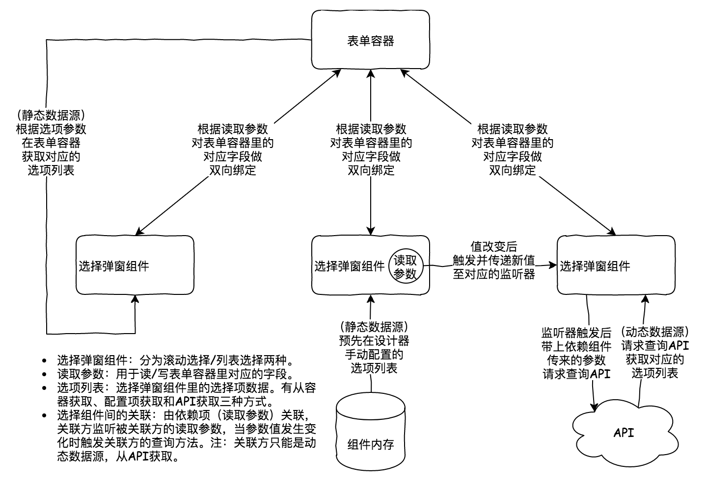

# 列表选择弹窗 

----

## 简介
滚动选择弹窗组件，单选，支持级联。

### 功能
以滚动的方式选择选项，单选，支持多个组件间级联选择。

### 应用场景

* 单独使用没有意义，需要结合表单容器一同使用。
* 当选项过多时，使用滚动弹窗展示并选择内容。
* 当某个选项依赖其他选项时，作级联选择。

### 配置流程



### 缩略图









### 组件依赖



## 配置说明

|配置项|必填|数据类型|格式|备注|
|:--|:--|:--|:--|:--|
|标题|是|String|XXX|无|
|提示文字|是|String|请选择XXX|无|
|读取参数|是|String|`dataKay`|用于取选择框默认值|
|对齐方式|是|Radio||无|
|是否自读|是|Boolean||无|
|是否必填|是|Boolean||无|
|是否关联|是|Boolean||无|
|依赖项|是|String|`dataKey`|用于选择框间的多级联动，存在多个时`,`号拼接|
|数据类型|是|Radio||存在依赖项时，只能设置动态数据源|
|配置方式|是|Radio||无|
|选项参数|是|String|`optionsDataKey `|用于在表单容器取选项的值|
|选项名|是|String|ABC|手动配置静态数据源时，设置选项名|
|选项值|是|String|ABC|手动配置静态数据源时，设置选项值|
|查询API|是|String|[/xx/xx]() or [http://xxx/xx/xx]() or [https://xxx/xx/xx]()|用于从API取选项的值|

## 注意事项

* 存在依赖项时，只能设置动态数据源。
* 存在多个依赖项时`,`号拼接。
* 手动配置静态数据源时，选项名和选项值为必填项，没有个数限制，但存在过多数据时建议设置动态数据源。
* 数据格式
 
```javascript
{
  optionsDataKey: [
    {
      name: '', // 选项名
      value: '' // 选项值
    },
    ...
  ]
}
```
