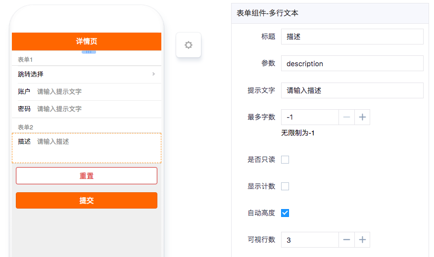

# 多行文本框

---

## 简介

### 主要功能

多行文本主要用于字数较多的文本录入。

### 应用场景

需要录入的文字较多时使用多行文本框，比如描述详情、意见反馈等。

### 缩略图

## 配置说明

| 配置项 | 描述 | 是否必填 | 备注 |
| :--- | :--- | :--- | :--- |
| 标题 | 该表单组件的标题 | 是 | 无 |
| 参数 | 该表单组件对应的API关键字。 | 是 | 无 |
| 提示文字 | 无填写内容时的提示文字，尽量与内容要求相关。 | 否 | 无 |
| 最多字数 | 填写内容最多可填字数，如果超过该字数则无法继续输入。 | 否 | 没有限制则设为-1 |
| 是否必填 | 是否必须填入内容。 | 否 | 无 |
| 是否只读 | 设为只读则不能填写内容。 | 否 | 无 |
| 显示计数 | 是否显示输入字数的计数器。 | 否 | 无 |
| 自动高度 | 文本框的高度会随着输入文字的数量自适应变化。 | 否 | 无 |
| 可视行数 | 最少显示几行文本框内容。 | 否 | 无 |