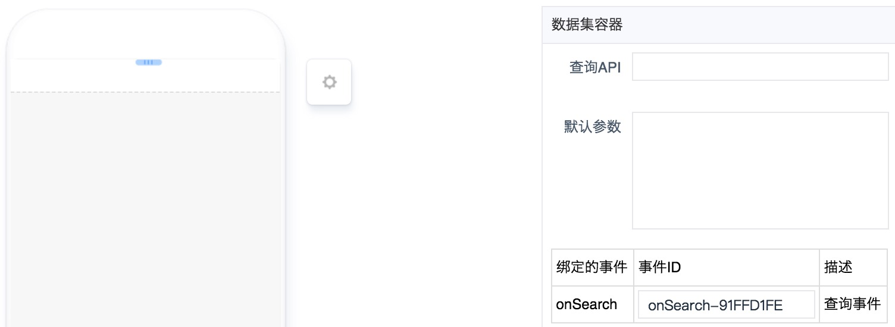
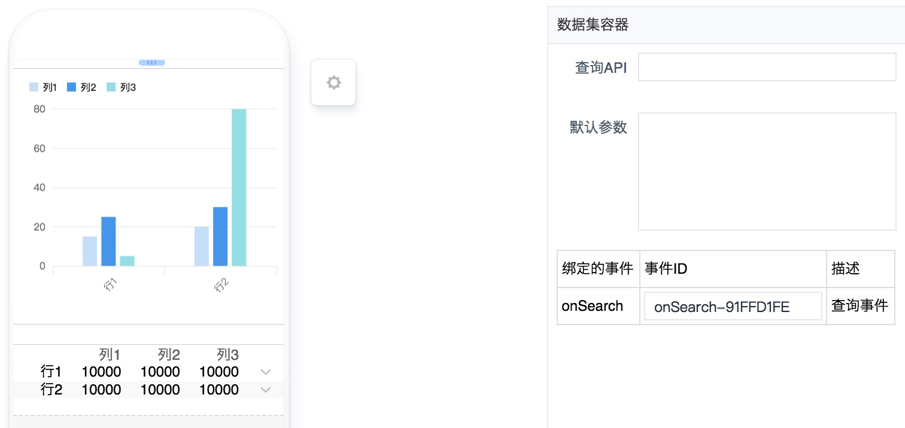
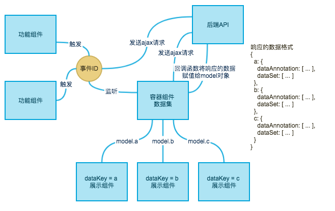

# 数据集组件

----

## 简介

### 功能

**请求**、**承载**、**分发**数据，**监听**查询事件，当对应的查询事件被触发后，会带上事件传递过来的参数，重新请求后端API。

### 应用场景

单独使用没有意义，需要结合**展示组件**一同使用。

### 缩略图





### 组件依赖



## 配置说明

|配置项|必填|数据类型|格式|备注|
|:--|:--|:--|:--|:--|
|查询API|是|String|[/xx/xx]() or [http://xxx/xx/xx]() or [https://xxx/xx/xx]()|无|
|默认参数|否|Json|`{"getdate":"new Date()"}`|无|

## 注意事项

* 目前仅支持`GET`请求。
* `dataKey`需要事先与后端商量好，配置页面时，在对应的展示组件填上`dataKey`。
* **默认参数**传入`new Date()`就是取当前时间。
* 数据格式
  * 单数据源
	 
  ```
  {
    default: {
      dataAnnotation: [
        {
          key: 'a',
          label: ''
        }, {
          key: 'b',
          label: ''
        }
      ],
      dataSet: [
        {
          id: '', // 作为跳转时的参数
          buguid: '', // 作为跳转时的参数
          a: '',
          b: ''
        }
      ]
    }
  }
  ```

  * 多数据源
	 
  ```
  {
    dataKey1: {
      dataAnnotation: [ ... ],
      dataSet: [ ... ]
    },
    dataKey2: {
      dataAnnotation: [ ... ],
      dataSet: [ ... ]
    }
  }
  ```

  * 带详情的数据源
	 
  ```
  {
    default: {
      dataAnnotation: [
        {
          key: 'a',
          label: ''
        }, {
          key: 'b',
          label: ''
        }
      ],
      dataSet: [
        {
          fields: {
            id: '', // 作为跳转时的参数
            buguid: '', // 作为跳转时的参数
            a: '',
            b: ''
          },
          detailData: [
            {
              a: '',
              b: ''
            }, {
              a: '',
              b: ''
            }
          ]
        }
      ]
    }
  }
  ```
