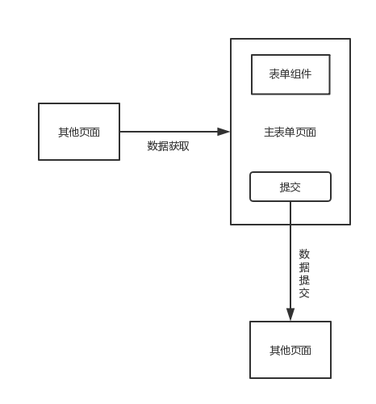
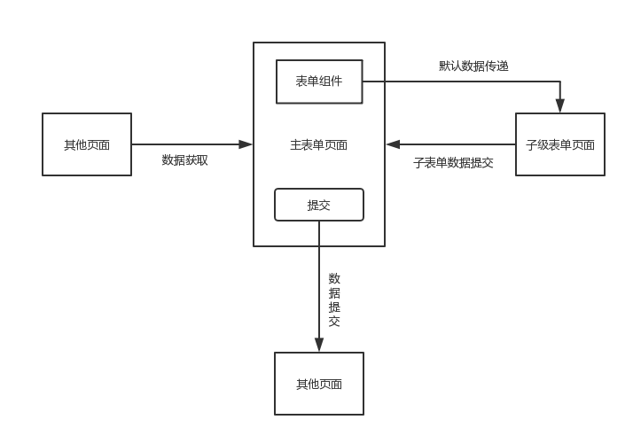
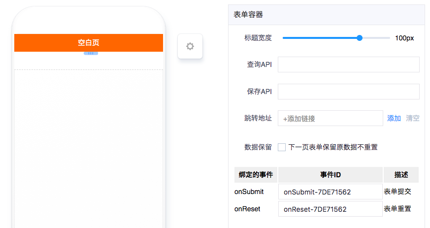

# 表单容器

---

## 简介

### 主要功能

- 负责容器内表单组件的数据**分发**和**收集**；
- 主要用于一级表单，同时也可以通过**链接跳转**的形式构建多级表单，各级表单数据通过route参数形式传递。

### 应用场景

- 一级表单：最基本的表单场景

- 多级表单：表单容器中有某个组件需要从其他表单页去获取数据，并回填到主表单，多用于某一条数据项相对复杂的情况，例如购物应用提交订单时的收货方式字段，其中包含了快递方式、地址等其他字段

### 缩略图

## 配置说明

| 配置项 | 描述 | 是否必填 | 备注 |
| :--- | :--- | :--- | :--- |
| 标题宽度 | 容器内表单组件的标题宽度设置 | 是 | 暂时没有预览效果，请到真实环境查看效果。 |
| 查询API | 容器内表单组件的默认值API，会在表单页面加载时自动填充到各组件。 | 否 | 无 |
| 保存API | 整个表单提交数据的API地址，如果没有提交数据需求可不填，比如子级表单。 | 否 | 无 |
| 跳转地址 | 提交操作后的跳转地址，通常在作为子级表单是配置。 | 否 | 无 |
| 数据保留 | 勾选则跳转后的表单不会自动从API拉取默认值。 | 否 | 子级表单建议勾选该项 |

## 注意事项

### 接口数据规范

